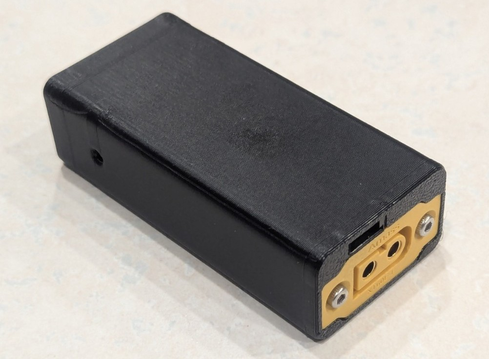
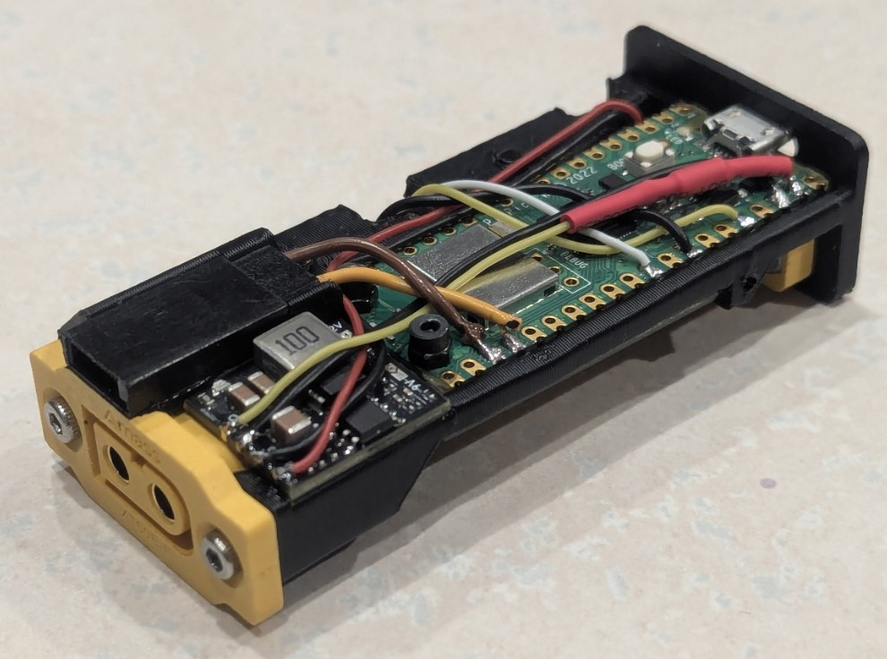

# Smart-RC-Power-Meter

Power analyzer for RC electronics, with wireless data visualization
Currently assembled from COTS breakout boards, but intended to be integrated into a single custom PCB in the future.

## Prototype Images

    <figure style="margin: 0;">
        
        <figcaption>Smart RC power meter prototype</figcaption>
    </figure>
    <figure style="margin: 0;">
        
        <figcaption>Internal electronics sled</figcaption>
    </figure>

## Features

- Uses bidirectional DSHOT to read motor telemetry (voltage, current, temperature, RPM estimate) on supported ESCs
- Measures current up to 150A using an external hall-effect current sensor
- Measures input voltage through a voltage divider using the RP2040's internal ADC (~15mV resolution)
- Input voltage safe up to 8s (technically rated up to 12s max, but you need to mitigate the risk of voltage spikes)
- Real-time configuration and data visualization through a local web interface
- Data logging to CSV files for post-test analysis

## Hardware

| System         | Component                                                    |
| -------------- | ------------------------------------------------------------ |
| MCU            | [Raspberry Pi Pico W](https://www.adafruit.com/product/5526) |
| Buck Converter | [Matek mBEC12S](https://a.co/d/438nlUi)                      |
| Current Sensor | [ACS72981KLRATR-150U3](https://www.pololu.com/product/5279)  |
